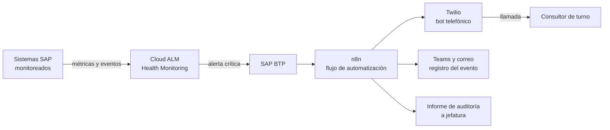
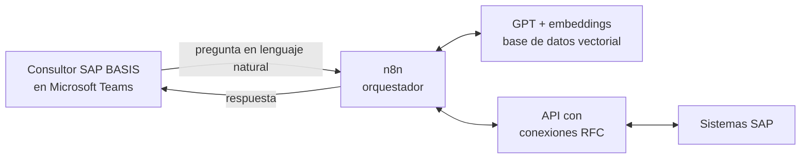

# Gabriel Barrios Cumare

**Ingeniero Civil Informático · Automatización, Agentes de IA y Desarrollo de Aplicaciones**

Santiago, Chile

[Sobre mí](#sobre-mí) · [Stack](#stack) · [Casos destacados](#casos-destacados) · [Repositorios](#repositorios) · [Formación](#formación) · [Contacto](#contacto)

---

## Sobre mí

Desarrollo soluciones que automatizan operaciones técnicas para hacerlas más rápidas y confiables, combinando monitoreo, integración de sistemas e inteligencia artificial.

Opero plataformas SAP críticas 24/7 para una cartera de clientes, donde aprendí lo que cuesta una caída y lo que vale reaccionar a tiempo. Desde esa base construí un robot de alertas de emergencia y participé en el desarrollo de un agente de IA que consulta sistemas SAP en lenguaje natural.

Hoy busco un rol de **desarrollo de aplicaciones o automatización**, donde pueda aplicar monitoreo e inteligencia artificial a problemas reales de operación.

| ⏱️ **30 → 2 min** | 🖥️ **90+ sistemas** | 📞 **24/7** |
|:---:|:---:|:---:|
| Resumen ejecutivo diario, automatizado con un agente de IA | Con SAP Cloud ALM implementado (600+ métricas y eventos) | Operación de plataformas críticas y guardias |

---

## Stack

**Automatización e IA**

**SAP y operaciones**

**Desarrollo**

---

## Casos destacados

Los dos proyectos más importantes se desarrollaron dentro de una empresa de servicios SAP, por eso no tienen repositorio público. Aquí se explican con diagramas genéricos, sin nombres de clientes, sistemas ni datos reales.

### 1. Robot de alertas de emergencia para guardias SAP

**Problema.** En una operación 24/7, cada minuto con un sistema crítico caído tiene un costo. El aviso al consultor de turno debía ser inmediato y difícil de pasar por alto.

**Solución.** El proyecto nació con la implementación de SAP Cloud ALM y su Health Monitoring, que genera alertas a partir de métricas. Luego, mediante SAP BTP, conecté esas alertas con n8n y programé en Twilio un bot telefónico que llama al consultor de turno cuando cae un sistema crítico. El flujo también registra el evento en Teams y correo, deja constancia de qué llamadas fueron contestadas y cuáles no, y entrega automáticamente un informe de auditoría a jefatura.

**Resultado.** Menor tiempo de reacción del turno ante incidentes reales y menores costos por inoperabilidad productiva. El informe permite identificar qué sistemas presentan más caídas y cuáles son los más críticos.

**Mi rol.** Diseño y desarrollo de punta a punta: integración de las alertas, flujo en n8n y programación del bot telefónico.

**Tecnologías.** SAP Cloud ALM · SAP BTP · n8n · Twilio · Microsoft Teams

---

### 2. Agente de IA para consultas SAP en lenguaje natural

**Problema.** Las consultas del día a día de un consultor SAP BASIS (estado del sistema, espacio, usuarios) obligaban a ingresar a SAP GUI o a la consola. Además, el resumen ejecutivo diario consistía en revisar unas 15 transacciones y volcarlas a un Excel, un proceso manual de unos 30 minutos.

**Solución.** Un agente que responde esas consultas desde Microsoft Teams, en lenguaje natural y en tiempo real. Usa n8n como orquestador, una API con conexiones RFC hacia los sistemas SAP, GPT y embeddings de OpenAI con una base de datos vectorial para mejorar el comportamiento del agente.

**Resultado.** El resumen ejecutivo diario pasó de unos 30 minutos manuales a 2 minutos automáticos: basta con indicar el sistema y el agente obtiene la información por RFC. Las consultas rutinarias se resuelven sin abrir la consola.

**Mi rol.** Participación en el desarrollo del agente durante 6 meses.

**Tecnologías.** n8n · OpenAI (GPT y embeddings) · Bases de datos vectoriales · RFC · APIs · Microsoft Teams

---

## Repositorios

Proyectos con código público:

| Proyecto | Qué hace | Stack | Código |
|---|---|---|---|
| **ChatBot-Octopus** | Chatbot con IA generativa que responde consultas sobre datos propios en formato JSON, integrando una base de datos vectorial con OpenAI | TypeScript · OpenAI · Astra DB | [Ver repositorio](https://github.com/gbarrioscumare/ChatBot-Octopus) |
| **App-RA-Leyes-de-Newton** | Aplicación de realidad aumentada que simula el comportamiento físico de objetos 3D para aprender las leyes de Newton. Proyecto de tesis, Universidad Andrés Bello | Unity · C# | [Ver repositorio](https://github.com/gbarrioscumare/App-RA-Leyes-de-Newton) |
| **AppFundacionMJRfinal** | Aplicación móvil para la Fundación María José Reyes que orienta a madres gestantes y padres con actividades de aprendizaje y motivación | JavaScript | [Ver repositorio](https://github.com/gbarrioscumare/AppFundacionMJRfinal) |

---

## Formación

- **Ingeniero Civil Informático**, Universidad Andrés Bello (2018 – 2024)
- **SAP Business AI Portfolio**, SAP (2024)
- **Python for Data Science**, IBM (2024)
- **Ethical Hacking Essentials**, EC-Council (2023)
- **Programa de Mentorías Trainee 2025**, SEIDOR Chile

---

## Contacto

Si tienes un rol de desarrollo de aplicaciones, automatización o IA aplicada, me encantaría conversar.

- LinkedIn: [linkedin.com/in/gbarrios-cumare](https://www.linkedin.com/in/gbarrios-cumare/)
- Correo: [g.barrioscumare@gmail.com](mailto:g.barrioscumare@gmail.com)
